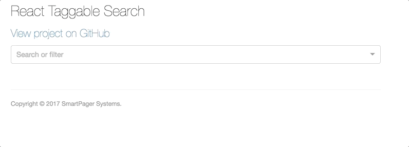

[](https://badge.fury.io/js/react-taggable-search)
[](https://travis-ci.org/Telmediq/react-taggable-search)

[](https://nodei.co/npm/react-taggable-search/)


# React Taggable Search

A React/Redux taggable search input that can accept tags with dynamic options. Based off of the excellent [react-select](https://github.com/jedwatson/react-select) by Jed Watson. 

## Demo & Examples



To build the examples locally, run:

```
npm install
npm start
```

Then open [`localhost:8000`](http://localhost:8000) in a browser.


## Installation

The easiest way to use react-taggable-search is to install it from NPM and include it in your own React build process (using [Browserify](http://browserify.org), [Webpack](http://webpack.github.io/), etc).

```
npm install react-taggable-search --save
```


## Usage
First, connect the taggableReducer to your Redux store:
 ```
 import {taggableReducer} from 'react-taggable-search';
 import {createStore, combineReducers, applyMiddleware} from 'redux';
 import thunk from 'redux-thunk';
  
 const reducers = combineReducers({taggableSearch: taggableReducer, ..rest});
 const store = createStore(
    reducers,
    applyMiddleware(
        thunk,
        // Other middleware
    )
 );
 ```

The ReactTaggableSearch accepts the following props:

| Prop      | Description                                                                                                               |
| --------- | ------------------------------------------------------------------------------------------------------------------------- |
| searchKey | <string> A unique key for this search component                                                                           |
| searchFn  | <function> A callback function for searching. Parameters will be passed as an object of key/value pairs specified by tags |
| tags      | <array> An array of tag objects (see below)                                                                               |

A **tag object** can be one of two objects:
```
// A local tag
{
	tagKey: "somekey", // The query parameter key
	tagLabel: "Some Label", // The label to show in the search bar
	tagStyle: {background: 'red'}, // (Optional) A custom CSS style to apply to the tag once it is selected
	options: [{key: "some option key", label: "Some Option Label"}] // The options available for the tag
}

// A fetched tag
{
	tagKey: "somekey", // The query parameter key,
	tagLabel: "Some Label", // The label to show in the search bar
	tagStyle: {background: 'red'}, // (Optional) A custom CSS style to apply to the tag once it is selected
	optionResourceUri: "https://api.github.com/orgs/telmediq/repos/", // The resource URI to fetch the options from
	optionResourceUriHeaders: {}, // An object with any request headers required
	optionResourceCreationFactory: (resp)=>{}, // A function that takes a response from the optionResourceUri and returns a list of option objects with key and value properties 	
}
```

```
var ReactTaggableSearch = require('react-taggable-search');

<ReactTaggableSearch {...props}/>
```

## Development (`src`, `lib` and the build process)

**NOTE:** The source code for the component is in `src`. A transpiled CommonJS version (generated with Babel) is available in `lib` for use with node.js, browserify and webpack. A UMD bundle is also built to `dist`, which can be included without the need for any build system.

To build, watch and serve the examples (which will also watch the component source), run `npm start`. If you just want to watch changes to `src` and rebuild `lib`, run `npm run watch` (this is useful if you are working with `npm link`).

## License

Copyright (c) 2017 SmartPager Systems.

